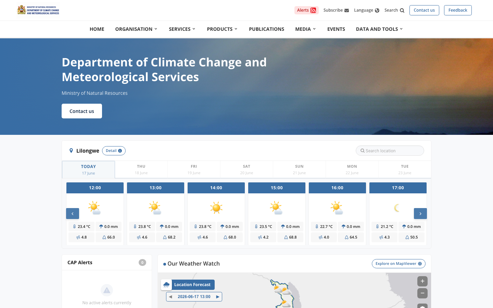
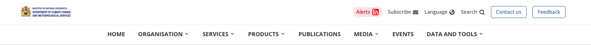
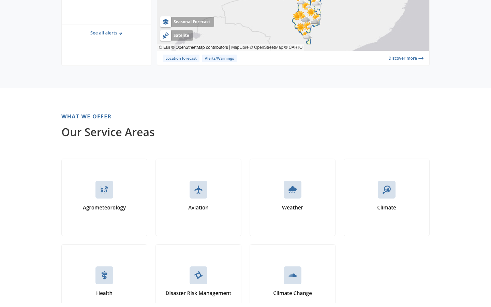
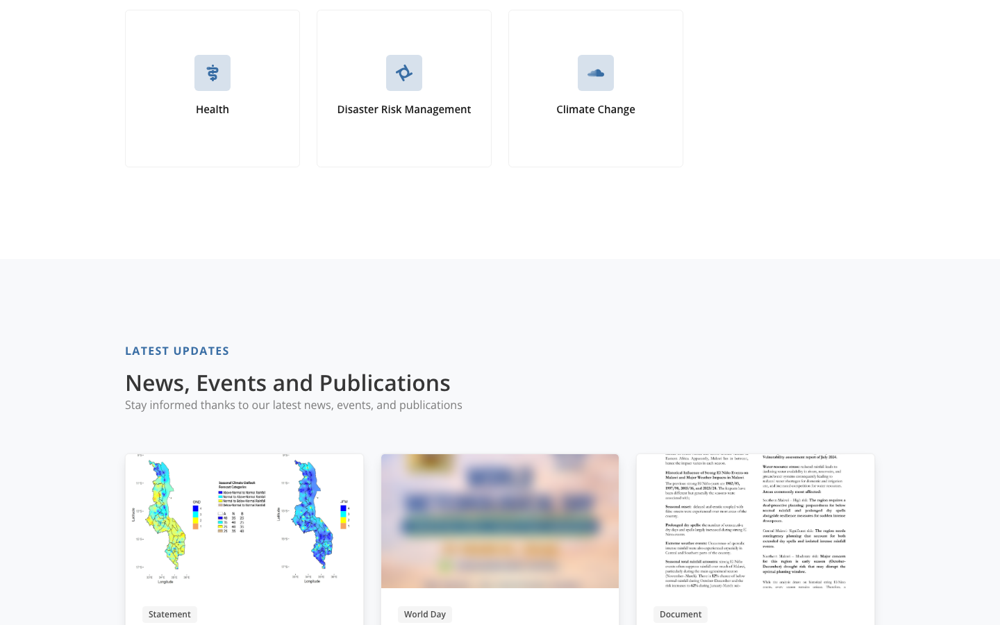
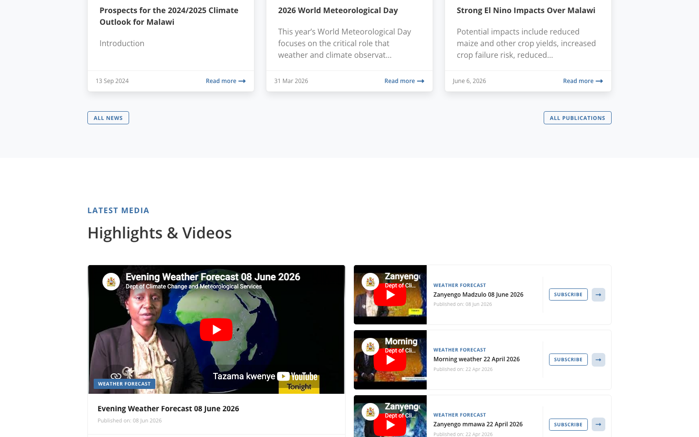
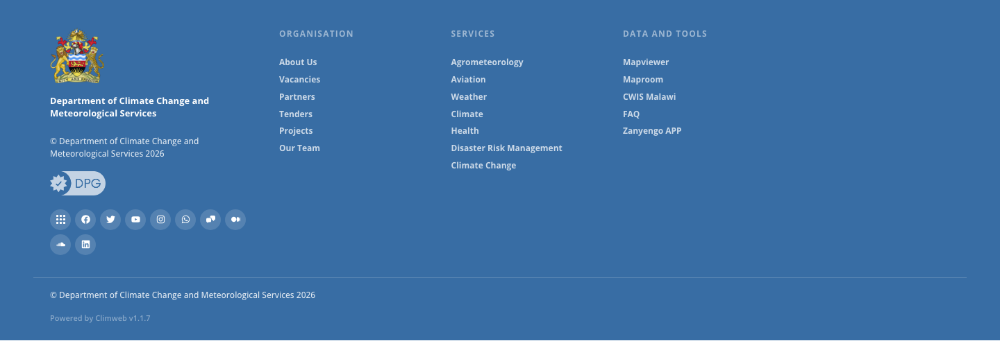

# Style Guide

Reference site: [Climweb](https://climtech.africa/climweb/) · Screenshots: [assets/style-guide/](assets/style-guide/)

---

## Colors

### Brand blues

| &nbsp; | Hex | Where it's used |
|---|---|---|
| <span style="display:inline-block;width:16px;height:16px;background:#0C447C;border-radius:3px;border:1px solid rgba(0,0,0,.15)"></span> | `#0C447C` | Primary — buttons, active nav links, footer background, icons, links |
| <span style="display:inline-block;width:16px;height:16px;background:#176C9C;border-radius:3px;border:1px solid rgba(0,0,0,.15)"></span> | `#176C9C` | Hover state for anything using the primary color |
| <span style="display:inline-block;width:16px;height:16px;background:#093766;border-radius:3px;border:1px solid rgba(0,0,0,.15)"></span> | `#093766` | Pressed / active state for buttons and interactive elements |
| <span style="display:inline-block;width:16px;height:16px;background:#226296;border-radius:3px;border:1px solid rgba(0,0,0,.15)"></span> | `#226296` | Secondary buttons and accent elements |
| <span style="display:inline-block;width:16px;height:16px;background:#3E8ED0;border-radius:3px;border:1px solid rgba(0,0,0,.15)"></span> | `#3E8ED0` | Informational highlights and inline links |
| <span style="display:inline-block;width:16px;height:16px;background:#E6F1FB;border-radius:3px;border:1px solid rgba(0,0,0,.15)"></span> | `#E6F1FB` | Tinted section backgrounds and icon fill backgrounds |
| <span style="display:inline-block;width:16px;height:16px;background:#EAF2F9;border-radius:3px;border:1px solid rgba(0,0,0,.15)"></span> | `#EAF2F9` | Very light wash — subtle alternating rows or hover fills |
| <span style="display:inline-block;width:16px;height:16px;background:#0A2240;border-radius:3px;border:1px solid rgba(0,0,0,.15)"></span> | `#0A2240` | Dark hero overlays and dark panel backgrounds |

### Grays

| &nbsp; | Hex | Where it's used |
|---|---|---|
| <span style="display:inline-block;width:16px;height:16px;background:#FFFFFF;border-radius:3px;border:1px solid rgba(0,0,0,.15)"></span> | `#FFFFFF` | Default page and card background; text on dark backgrounds; footer text |
| <span style="display:inline-block;width:16px;height:16px;background:#F8F9FB;border-radius:3px;border:1px solid rgba(0,0,0,.15)"></span> | `#F8F9FB` | Alternate section backgrounds (slightly off-white) |
| <span style="display:inline-block;width:16px;height:16px;background:#F4F6F9;border-radius:3px;border:1px solid rgba(0,0,0,.15)"></span> | `#F4F6F9` | Dropdown and hover backgrounds |
| <span style="display:inline-block;width:16px;height:16px;background:#E0E0E0;border-radius:3px;border:1px solid rgba(0,0,0,.15)"></span> | `#E0E0E0` | Light gray card and section backgrounds |
| <span style="display:inline-block;width:16px;height:16px;background:#DCDCDC;border-radius:3px;border:1px solid rgba(0,0,0,.15)"></span> | `#DCDCDC` | Borders and dividers |
| <span style="display:inline-block;width:16px;height:16px;background:#707070;border-radius:3px;border:1px solid rgba(0,0,0,.15)"></span> | `#707070` | Secondary / helper text |
| <span style="display:inline-block;width:16px;height:16px;background:#999999;border-radius:3px;border:1px solid rgba(0,0,0,.15)"></span> | `#999999` | Muted text — timestamps, captions, placeholders |
| <span style="display:inline-block;width:16px;height:16px;background:#363636;border-radius:3px;border:1px solid rgba(0,0,0,.15)"></span> | `#363636` | Default body text |
| <span style="display:inline-block;width:16px;height:16px;background:#1A1A1A;border-radius:3px;border:1px solid rgba(0,0,0,.15)"></span> | `#1A1A1A` | Headings and display text |
| <span style="display:inline-block;width:16px;height:16px;background:#262C38;border-radius:3px;border:1px solid rgba(0,0,0,.15)"></span> | `#262C38` | Top alert bar and sticky navigation background |

### Status colors

| &nbsp; | &nbsp; | Hex (background / text+icon) | Where it's used |
|---|---|---|---|
| <span style="display:inline-block;width:16px;height:16px;background:#D1FAE5;border-radius:3px;border:1px solid rgba(0,0,0,.15)"></span> | <span style="display:inline-block;width:16px;height:16px;background:#0B612D;border-radius:3px;border:1px solid rgba(0,0,0,.15)"></span> | `#D1FAE5` / `#0B612D` | Success |
| <span style="display:inline-block;width:16px;height:16px;background:#FEF3C7;border-radius:3px;border:1px solid rgba(0,0,0,.15)"></span> | <span style="display:inline-block;width:16px;height:16px;background:#92400E;border-radius:3px;border:1px solid rgba(0,0,0,.15)"></span> | `#FEF3C7` / `#92400E` | Warning |
| <span style="display:inline-block;width:16px;height:16px;background:#FEE2E2;border-radius:3px;border:1px solid rgba(0,0,0,.15)"></span> | <span style="display:inline-block;width:16px;height:16px;background:#B91C1C;border-radius:3px;border:1px solid rgba(0,0,0,.15)"></span> | `#FEE2E2` / `#B91C1C` | Danger / error |
| <span style="display:inline-block;width:16px;height:16px;background:#DBEAFE;border-radius:3px;border:1px solid rgba(0,0,0,.15)"></span> | <span style="display:inline-block;width:16px;height:16px;background:#1E40AF;border-radius:3px;border:1px solid rgba(0,0,0,.15)"></span> | `#DBEAFE` / `#1E40AF` | Informational |

### CSS Variables

```css
:root {
  --primary-color:     #0C447C;
  --text-color:        #363636;
  --background-color:  #E6F1FB;
  --border-radius:     12px;
}
```

---

## Typography

**Font:** Open Sans (Google Fonts) — weights 300 / 400 / 500 / 600 / 700 / 800

```html
<link href="https://fonts.googleapis.com/css2?family=Open+Sans:ital,wght@0,300;0,400;0,500;0,600;0,700;0,800;1,300;1,400;1,500;1,600;1,700;1,800&display=swap" rel="stylesheet">
```

```css
font-family: 'Open Sans', Helvetica, Arial, sans-serif;
```

### Scale

| Token | Web | RN (sp) | Weight | Usage |
|---|---|---|---|---|
| `display` | 56px | 40 | 800 | Hero headlines |
| `h1` | 40px | 32 | 700 | Page titles |
| `h2` | 32px | 26 | 700 | Section headings |
| `h3` | 24px | 20 | 600 | Sub-section headings |
| `h4` | 20px | 17 | 600 | Card titles |
| `h5` | 16px | 15 | 600 | Small headings |
| `body-lg` | 18px | 16 | 400 | Lead paragraphs |
| `body` | 16px | 14 | 400 | Default copy |
| `body-sm` | 14px | 13 | 400 | Secondary text |
| `caption` | 12px | 12 | 400 | Timestamps, metadata |
| `label` | 12px | 11 | 600 | Form labels, badges |

---

## Spacing

4px base unit.

| Token | px |
|---|---|
| `space-1` | 4 |
| `space-2` | 8 |
| `space-3` | 12 |
| `space-4` | 16 |
| `space-6` | 24 |
| `space-8` | 32 |
| `space-10` | 40 |
| `space-12` | 48 |
| `space-16` | 64 |

---

## Border Radius

| Token | Value | Usage |
|---|---|---|
| `radius-sm` | 4px | Tags, badges |
| `radius-md` | 8px | Inputs |
| `radius-lg` | 12px | **Default** — cards, dropdowns |
| `radius-xl` | 16px | Modals |
| `radius-full` | 9999px | Pill badges, avatars |

---

## Shadows

| Token | `box-shadow` | Android `elevation` |
|---|---|---|
| `shadow-sm` | `0 1px 2px rgba(0,0,0,.06), 0 1px 3px rgba(0,0,0,.10)` | 2 |
| `shadow-md` | `0 4px 6px rgba(0,0,0,.07), 0 2px 4px rgba(0,0,0,.06)` | 4 |
| `shadow-lg` | `0 10px 15px rgba(0,0,0,.08), 0 4px 6px rgba(0,0,0,.05)` | 8 |
| `shadow-xl` | `0 20px 25px rgba(0,0,0,.10), 0 10px 10px rgba(0,0,0,.04)` | 12 |

---

## Components

### Buttons

| Variant | Background | Text | Border |
|---|---|---|---|
| Primary | `#0C447C` | `#FFF` | none |
| Secondary | `#226296` | `#FFF` | none |
| Ghost | transparent | `#0C447C` | 1.5px `#0C447C` |
| Danger | `#B91C1C` | `#FFF` | none |

Height: 32px (sm) / 40px (md) / 48px (lg). Font: Open Sans 600. Radius: 12px.

### Inputs

Height: 40px. Border: 1.5px `#DCDCDC`. Radius: 8px. Focus border: `#176C9C` + `0 0 0 3px #176c9c33`.

### Cards

Background: white. Border: 1px `#E0E0E0`. Radius: 12px. Shadow: `shadow-sm`. Padding: 24px.

### Badges

Radius: 9999px. Padding: 4px 12px. Font: 12px / weight 600.

| Variant | Background | Text |
|---|---|---|
| Primary | `#E6F1FB` | `#0C447C` |
| Success | `#D1FAE5` | `#0B612D` |
| Warning | `#FEF3C7` | `#92400E` |
| Danger | `#FEE2E2` | `#B91C1C` |

### Alerts

Left border: 4px in status color. Radius: 8px. Padding: 16px 24px.

---

## Layout

- **Grid:** 12 columns, 24px gutter, 1344px max width
- **Breakpoints:** 480 / 768 / 1024 / 1216 / 1408px
- **Nav height:** 64px desktop / 56px mobile
- **Alert bar height:** 36px (background: `#262C38`)

---

## React Native

### Fonts

```ts
import { OpenSans_400Regular, OpenSans_600SemiBold, OpenSans_700Bold, OpenSans_800ExtraBold } from '@expo-google-fonts/open-sans';
```

### Theme constants

```ts
export const colors = {
  primary:    '#0C447C',
  primaryHov: '#176C9C',
  primaryPrs: '#093766',
  accent:     '#226296',
  bgTint:     '#E6F1FB',
  bgOverlay:  '#0A2240',
  bgFooter:   '#0C447C',
  text:       '#363636',
  textStrong: '#1A1A1A',
  textSubtle: '#707070',
  textMuted:  '#999999',
  textInverse:'#FFFFFF',
  border:     '#DCDCDC',
  focus:      '#176C9C',
  success:    '#0B612D', successBg: '#D1FAE5',
  warning:    '#92400E', warningBg: '#FEF3C7',
  danger:     '#B91C1C', dangerBg:  '#FEE2E2',
  info:       '#1E40AF', infoBg:    '#DBEAFE',
} as const;

export const space = { 1:4, 2:8, 3:12, 4:16, 6:24, 8:32, 10:40, 12:48, 16:64 } as const;
export const radius = { sm:4, md:8, lg:12, xl:16, full:9999 } as const;
```

### Shadows

```ts
import { Platform } from 'react-native';
const shadow = (elev: number) => Platform.select({
  ios:     { shadowColor: '#000', shadowOffset: { width: 0, height: elev / 2 }, shadowOpacity: 0.10 + elev * 0.005, shadowRadius: elev * 1.5 },
  android: { elevation: elev },
});
// sm → shadow(2), md → shadow(4), lg → shadow(8), xl → shadow(12)
```

### Touch targets

Minimum **44×44px**. Use `hitSlop={{ top:8, bottom:8, left:8, right:8 }}` when the visual element is smaller.

---

## Visual Reference

| | |
|---|---|
|  |  |
|  |  |
|  |  |
